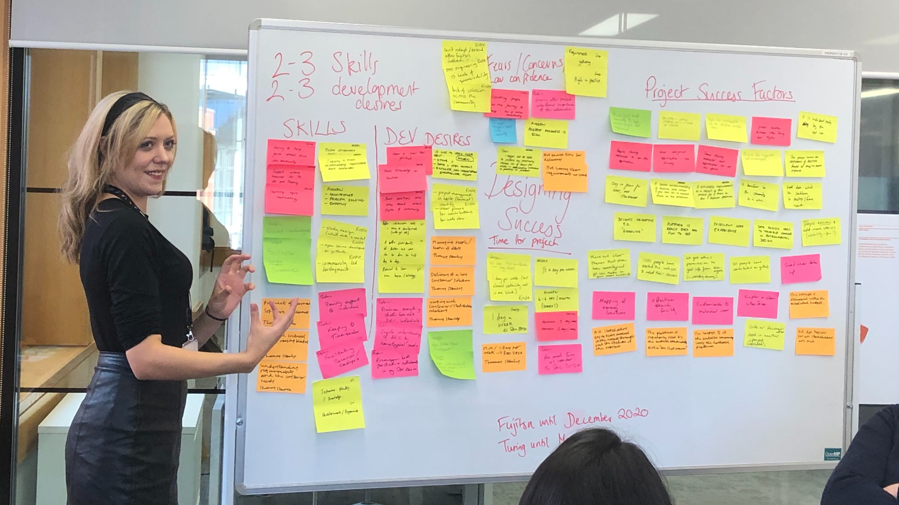
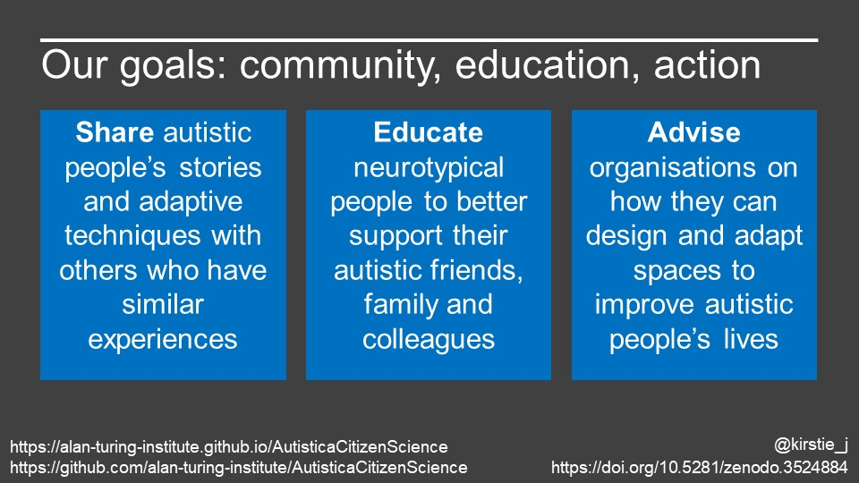
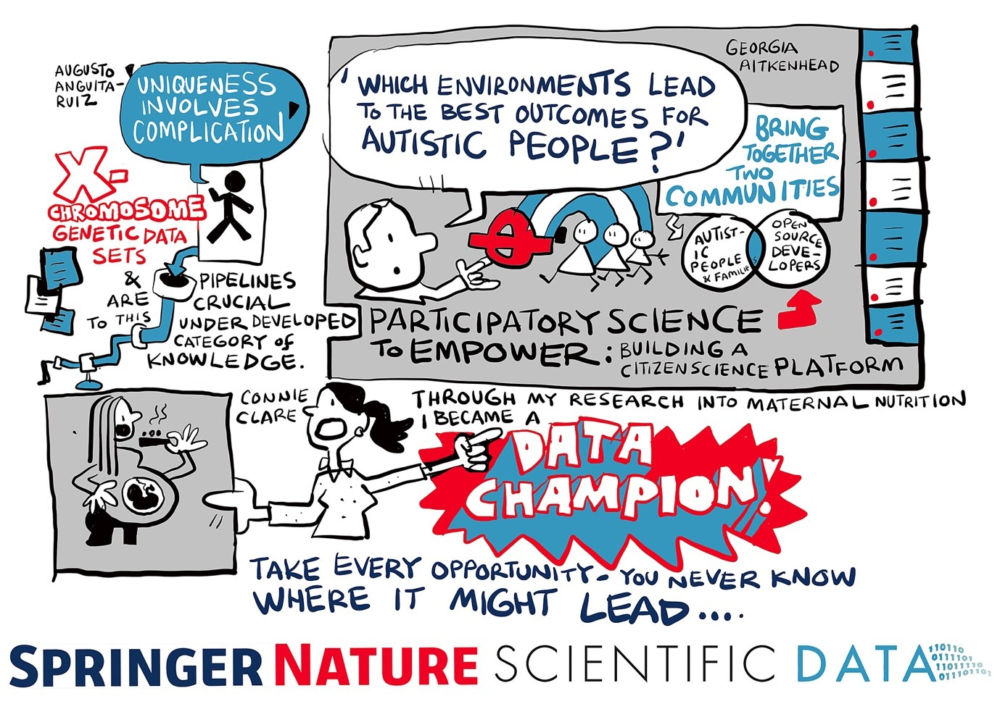

# Newsletter | November 2019

*Date sent: 25 November 2019*

Subject: November updates from the Autistica/Turing Citizen Science project

Hello,

This is the November 2019 newsletter for the Autistica/Turing Citizen Science project.

## Co-creating in person

### Focus groups

Thank you so much to everyone who attended the focus groups held at Fujitsu's offices in September and October.
These involved bringing together autistic people, the parents and carers of autistic people, and collaborators from Autistica, The Alan Turing Institute, Fujitsu, and subject matter experts.
(Including some participants who had overlapping areas of expertise!)
The discussions were extremely useful, and we gathered important insights which will be invaluable in progressing the goals of the project.

All 3 focus groups have now been transcribed and collated, and we’re fine-tuning the analysis process with help from an autistic collaborator.
The transcripts represent almost 15 hours of recording across 3 different sessions, requiring the editing and categorising of more than 150 pages of verbatim dialogue 🙀
(Great work Georgia!! 🙌).

The transcripts are a treasure-trove of insights, ideas, and lived experiences which are enormously valuable and hugely appreciated.
The final versions of the shorter summaries will be reviewed by the research team and sent to all attendees in early December before they’re uploaded onto GitHub.

### Technical sprint

Earlier this week we held a technical session with the Fujitsu team at The Alan Turing Institute to map out how we can best work together and with the community to deliver impact for autistic people and their families.
We also demonstrated collaborating on GitHub and agile delivery practice to share expertise and learn from each other.
There were lots of post its and some really useful conversations.
Thanks to everyone who took part!

## Presentations

Kirstie presented the project's philosophy and progress at a Springer Nature/British Library event which brought researchers together to ask, [Can opening up research help drive innovation and tackle global challenges?](https://natureecoevocommunity.nature.com/users/59876-ruth-milne/posts/54547-can-opening-up-research-help-drive-innovation).
You can see her slides at [10.5281/zenodo.3524883](https://doi.org/10.5281/zenodo.3524883).

Georgia gave a 7 minute lightning summary of the project with an emphasis on community empowerment, at Springer Nature's [#SciData19](https://www.springernature.com/gp/campaign/scidata) conference.
You can download her slides here: [10.5281/zenodo.3530453](https://doi.org/10.5281/zenodo.3530453) and [watch the talk](https://figshare.com/articles/Lightning_talks_7_data_sharing_stories_SciData19/10319534) online.

We also showcased the project at a stall at the British Library's Diversity and Inclusion event, with the help of an autistic collaborator who spoke passionately about how different environments affect him in his daily life.

Finally, you can [watch the Pint of Science panel](https://youtu.be/DNisoU9uXqk) on _Using citizen science to empower autistic people and build inclusive public spaces_ that was recorded in May with [Kirstie Whitaker](https://twitter.com/kirstie_j), [Dianna Smith](https://twitter.com/geodianna), [Georgia Aitkenhead](https://www.turing.ac.uk/people/researchers/georgia-aitkenhead), [Rebecca Sterry](https://twitter.com/bex_sterry) and [Suzanne Iwai](https://twitter.com/SuzanneIwai).

.

## Participate

### Building connections

We would love to link up with other citizen science projects or initiatives with matching values and goals, such as creating more enabling environments for autistic people or helping involve autistic people in more empowered positions in research.
If you know of any similar projects you think it would be useful for us to connect with or learn from, we’d be really grateful if you could share your suggestions with us.

The best way to share your feedback and suggestions is to fill in our online survey: [https://bit.ly/AutisticaTuringCitSciForm](https://bit.ly/AutisticaTuringCitSciForm).

If you find the form confusing or don't want to have your suggestion publicly available (no names will be associated with the information), you can also email Georgia at [gaitkenhead@turing.ac.uk](mailto:gaitkenhead@turing.ac.uk).

Any general feedback relating to the project is also always very welcome!

### User testing

We will be arranging user testing sessions with the Fujitsu team, most likely to be conducted via online video conferencing, to get feedback on the design for how people can interact with the platform.

We will recruit from Autistica's Discover network so if you’re a member look out for an email after the Christmas break.

You can find out more and sign up to join the network by following this link: [https://www.autistica.org.uk/get-involved/take-part-in-research](https://www.autistica.org.uk/get-involved/take-part-in-research)

## Community updates

### Autistica Discover conference

Autistica has announced the date of the next Discover conference: [10 July 2020](https://twitter.com/Autistica/status/1197100384659165184?s=20) at the University of Nottingham.
We hope to see many of you there.

### MQ Participate

Mental health charity MQ launched their research participation platform this week: [https://participate.mqmentalhealth.org](https://participate.mqmentalhealth.org/).
There are three studies on autism that you can volunteer to participate in, but also research projects on anxiety, depression, and many other aspects of mental health if you're interested in taking part.

## Thank you!

We are grateful to you all for your continuing help and support to work towards more enabling environments, and more inclusive research, for autistic people and their families.

All the best,

Kirstie and Georgia
