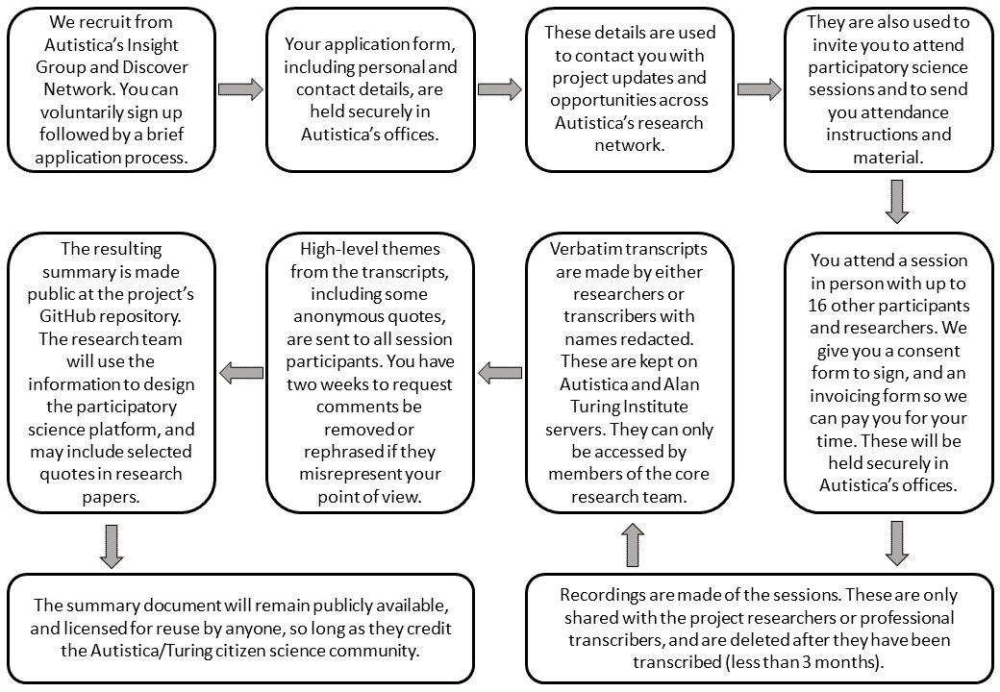
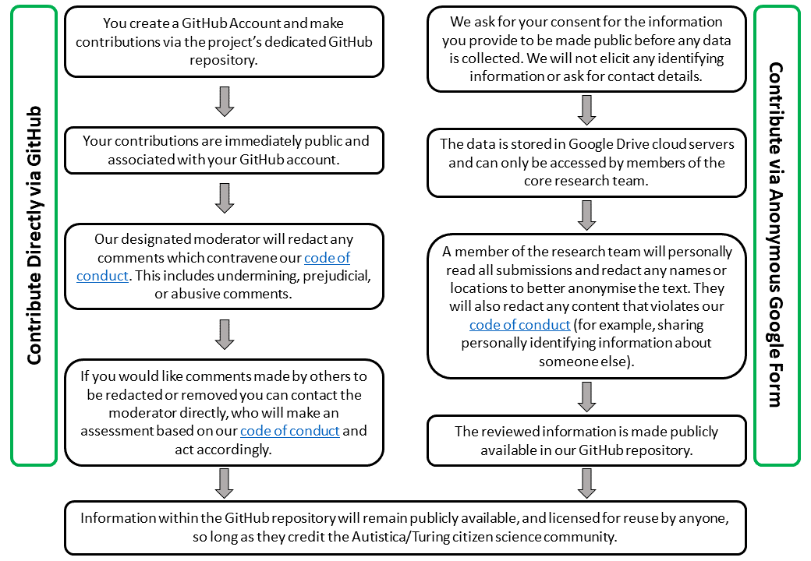

# Information sheet: Data collection, processing, and holding

_This document outlines how the research team, led by Dr Kirstie Whitaker, will manage our participants' and contributors' data as contributions to the Autistica/Turing Citizen Science community._
_It details the data we collect, what we do with it and why we collect it._

## In Person

We recruit for our in-person sessions from Autistica's Insight Group and Discover Network ([https://www.autistica.org.uk/get-involved/take-part-in-research](https://www.autistica.org.uk/get-involved/take-part-in-research)).
Individuals can voluntarily sign up and there is a brief application process.
They are given an application form to fill out and our Discover Network Co-Ordinator, Bethan Davies, contacts them once she has received the application.

The personal and contact details as well as some demographic information from the application form are held securely by Autistica.
Autistica use the contact details provided to contact the participant with project updates and opportunities from across Autistica's research network.
We use this information to invite a diverse and representative group of participants to the participatory science sessions.
For example, we make sure that autistic people are well represented at these sessions using the reported "autism diagnosis" field on the form.
Members of the Discover Network or Insight Group may ask to be removed from the database at any point by contacting Bethan Davies at discover@autistica.org.uk.

We use the contact details to send joining instructions for in-person sessions, including location, directions, and what to expect on the day.
The in-person sessions are groups of up to 16 participants and researchers to discuss topics relevant to the Citizen Science Project.
Participants are given a [consent form](A6_ConsentForm.pdf) to sign and return to the researchers, as well as an invoicing form.
We use the details provided on this form to pay participants for their time after the session has finished.
They are paid directly into the participant's bank account.
The consent form and invoice form are filed securely in Autistica's London offices.

Recordings are made of the sessions.
They are shared with the core researchers of the project and are destroyed after they have been transcribed.
This will be a maximum of 3 months after the recordings have been made.
Verbatim transcripts are made by either researchers or transcribers, with the names and any explicitly identifying details (such as address, child's school, or employer) redacted.
The anonymised transcripts are kept on Autistica and The Alan Turing Institute servers and only shared with the core research team.
These transcripts will be deleted at the end of the research collaboration period between the Turing Institute and Autistica (currently March 31 2021).

High-level themes from the transcripts, including some quotes, are sent to all session participants and the core research team.
Participants have two weeks to request comments be redacted or rephrased.
Our goal is to make sure that all participants are comfortable with the publicly released summary document.
After two weeks the summary document is made public at the project's dedicated GitHub repository ([https://github.com/alan-turing-institute/AutisticaCitizenScience](https://github.com/alan-turing-institute/AutisticaCitizenScience)).
The information is used to design and build the participatory science platform, and the themes along with selected quotes may be used in published research papers.
The summary document will remain publicly available, and licensed for reuse by anyone, so long as they credit the Autistica/Turing citizen science community.

*Figure 1: Data collection, processing and holding pathway for in-person events*

## Online

Contributions to the project can be made via GitHub at the project's dedicated repository ([https://github.com/alan-turing-institute/AutisticaCitizenScience](https://github.com/alan-turing-institute/AutisticaCitizenScience)).
Participants must have a GitHub account.
GitHub's privacy statement can be found at [https://help.github.com/en/articles/github-privacy-statement](https://help.github.com/en/articles/github-privacy-statement).
Contributions to the project repository are public and associated with the GitHub account of the contributor.

Our designated moderator will redact any comments which contravene our code of conduct.
This includes undermining, prejudicial, or abusive comments.
If participants would like comments made by others to be redacted or removed they can contact the moderator directly, who will make an assessment based on our [code of conduct](https://github.com/alan-turing-institute/AutisticaCitizenScience/blob/master/CODE_OF_CONDUCT.md) and act accordingly.
All other contributions remain publicly available.
All information within the GitHub repository is publicly available, and licensed for reuse by anyone, so long as they credit the Autistica/Turing citizen science community.

Contributions may also be made via Google Form ([https://goo.gl/forms/dDu0CDCLiXOm32GH3](https://goo.gl/forms/dDu0CDCLiXOm32GH3)).
Google's privacy statement can be found at [https://policies.google.com/privacy](https://policies.google.com/privacy).
Consent is sought for the information provided to be made public before any data is collected.
We do not elicit any identifying information or ask for contact details via Google Form.
The data is stored in Google Drive cloud servers and will be accessible by the core research team.
A member of the research team will personally assess all submissions and redact any names or locations to ensure the text is as anonymous as possible.
They will also redact any content which contravenes our [code of conduct](https://github.com/alan-turing-institute/AutisticaCitizenScience/blob/master/CODE_OF_CONDUCT.md) (for example, sharing personally identifying information about someone else).
The submitted, assessed information is made publicly available in our GitHub repository.
Information within the GitHub repository will remain publicly available, and is licensed for reuse by anyone, so long as they credit the Autistica/Turing citizen science community.

*Figure 2: Data collection, processing and holding pathway for online contributions*

## Mailing list

Members of the Autistica/Turing citizen science community may join a mailing list to receive monthly updates from the project at [https://tinyletter.com/AutisticaTuringCitizenScience](https://tinyletter.com/AutisticaTuringCitizenScience).
The mailing list is managed by MailChimp and their privacy policy can be found at [https://mailchimp.com/legal/privacy](https://mailchimp.com/legal/privacy).
Members of the mailing list are asked to confirm their subscription through a two stage process and may remove themselves at any time.
The contact information provided may be accessed by members of the research team.
It is never removed from the MailChimp platform.

